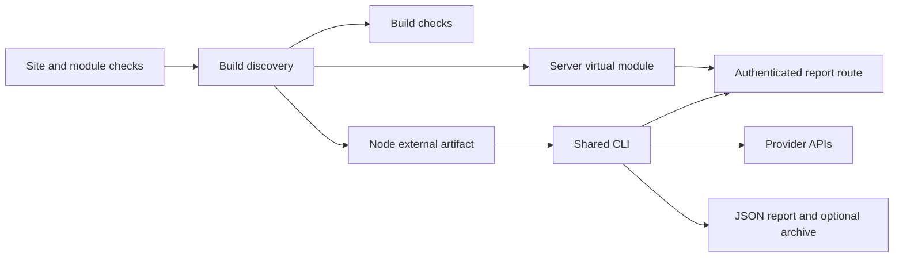

# Nuxt Check-in

Run deterministic checks from your Nuxt app and its modules.
Discover definitions at build time. Execute them through a route or an external runner.

## Install

```sh
pnpm add @harlan-zw/nuxt-checkin
```

```ts
export default defineNuxtConfig({
  modules: ['@harlan-zw/nuxt-checkin'],
})
```

The module scans `server/checks` in the app and every Nuxt layer.
Use `checkin.dirs` to supply explicit paths relative to the app root.
Tests, declaration files, and files starting with `_` are excluded.
Each file must default-export a factory call with a literal `id`.
Duplicate IDs stop the build. Discovery never executes check files.

## Site checks

```ts
// server/checks/catalog.ts
import { defineCheck, fail, pass, warn } from '@harlan-zw/nuxt-checkin/server'
import { readCatalogAge } from '../utils/catalog'

export default defineCheck({
  id: 'catalog.freshness',
  async run({ now, signal }) {
    const hours = await readCatalogAge({ now, signal })
    if (hours >= 24)
      return fail('Catalog is over 24 hours old.', { hours })
    if (hours >= 6)
      return warn('Catalog is over 6 hours old.', { hours })
    return pass({ hours })
  },
})
```

Checks receive `event`, `now`, `signal`, and named `credentials`.
Use `defineCheck<Event>()` when a custom check needs a typed request event.
The runner supplies one observation time to every check.
Keep domain evaluation pure when several callers need the same decision.

## Route

```ts
import { runChecks } from '@harlan-zw/nuxt-checkin/server'
import checks from '#checkin/checks'
import { requireAdmin } from '../../utils/auth'

export default defineEventHandler(async (event) => {
  await requireAdmin(event)
  return runChecks(checks, {
    event,
    identity: { site: 'example.com', environment: 'production', deployment: useRuntimeConfig(event).deploymentVersion },
    required: ['catalog.freshness'],
    concurrency: 4,
    timeoutMs: 10_000,
    totalTimeoutMs: 30_000,
  })
})
```

No route is installed automatically. The consuming app owns authentication.
The virtual module uses static imports and remains server-only.
Importing it loads definitions. Only `runChecks` performs the reads.
The registry refreshes when watched check files change during development.

## Results

| Result | Meaning |
| --- | --- |
| `pass(evidence)` | The check established its expected condition. |
| `warn(reason, evidence)` | The warning threshold was met. |
| `fail(reason, evidence)` | The failure threshold was met. |
| `unavailable(reason)` | Evidence could not establish health. |
| `skipped(reason)` | An explicit applicability decision prevented execution. |

The versioned report contains `identity`, `observedAt`, `severity`, `coverage`, ordered `results`, and `collections`.
Each result includes its ID and duration.
A failure stays visible even when another check has unavailable evidence.
Warn and Fail results can set `coverage: 'incomplete'` when their evidence is partial.
An empty registry has incomplete coverage.
Missing IDs from `required` produce explicit unavailable results. Maintain this list independently from discovery.
Never interpret `severity: pass` without checking `coverage`.

Thrown exceptions become `Unavailable`. Raw exceptions stay out of the returned report.
Use `onError(error, id)` to record them privately. Exceptions in that callback propagate.
Evidence must contain JSON values. Check authors own evidence redaction.
The default total deadline is 30 seconds. Expiry stops queued checks and cancels shared collection.
Independent checks have a separate ten-second default deadline.
Pass an AbortSignal to cancel a run. Checks must cooperate with cancellation for underlying work to stop.
Do not use checks to perform repairs, deploy, send messages, or change Sentry state.

## Existing modules

Each integration registers the same public factory that a site can import.
Registration is explicit. It does not add default production queries to existing installations.

```ts
export default defineNuxtConfig({
  modules: [
    '@harlan-zw/nuxt-checkin',
    '@harlan-zw/nuxt-cloudflare',
    '@harlan-zw/nuxt-cf-jobs',
    '@harlan-zw/nuxt-sentry',
  ],
  nuxtCloudflare: {
    checks: [{ id: 'd1.read', binding: 'DB' }],
  },
  cfJobs: {
    queues: { indexing: 'INDEXING_QUEUE' },
    checks: [{
      id: 'queue.indexing',
      queue: 'indexing',
      d1Binding: 'DB',
      warnAfterSeconds: 1800,
      failAfterSeconds: 7200,
      staleAfterSeconds: 900,
    }],
  },
  nuxtSentry: {
    dsn: 'https://public@example.com/1',
    project: 'site',
    checks: [{ id: 'sentry.site', org: 'example', project: 'site' }],
  },
})
```

Sentry checks need `id`, `org`, and `project`; optional `credential` defaults to `sentry`.
Supply the read token through `runChecks(checks, { credentials: { sentry: token } })`.
Never put tokens in Nuxt module options. Options enter the generated registry.

The D1 factory proves a read through the request's binding.
The queue factory uses existing Queue Job backpressure SQL and excludes future scheduled work.
It collects every queue once per database per run, using the supplied observation clock.
Set `failMinimumReady` when failure requires both age and volume. Reservation rules remain independent.
It expects the module's standard D1 tables. Missing or incompatible tables produce unavailable evidence.
The Sentry factory reads retained unresolved issues through the organization endpoint and follows pagination.
It explicitly selects the project and queries from the Unix epoch by default.
Use `environment` and `region` (`us` or `de`) to scope production collection.
Use `lookbackDays` only when deliberately checking a narrower window.
It warns on unresolved issues. It does not infer user impact or investigate stacks.
The default hundred-page limit and total deadline bound collection. Truncation produces incomplete coverage.
Known issues remain warnings with incomplete coverage when a later page returns an HTTP error.
A transient HTTP error receives at most one retry, respecting Retry-After waits up to five seconds.
Longer waits return unavailable evidence. Authorization failures are not retried.
Validate live project access and retained-issue coverage before retiring an existing Sentry routine.

Direct usage has the same behavior:

```ts
// server/checks/queue.ts
import { defineQueueCheck } from '@harlan-zw/nuxt-cf-jobs/checks'

export default defineQueueCheck({
  id: 'queue.indexing',
  queue: 'indexing',
  d1Binding: 'DB',
  warnAfterSeconds: 1800,
  failAfterSeconds: 7200,
})
```

Choose module registration or a site file for each ID. Registering both fails the build.

## Module authors

```ts
nuxt.hook('checkin:register', (registry) => {
  registry.add({
    id: 'catalog.freshness',
    handler: resolver.resolve('./checks'),
    options: { warnAfterSeconds: 3600 },
  })
})
```

The handler default-exports a public factory accepting `{ id, ...options }` and returning a Check.
Handlers use absolute paths. Options must be JSON values.
Contributions are collected after module setup, so registration does not depend on module order.
Installing a contributing module without Nuxt Check-in leaves this integration inactive.

## Runtime limits

Cloudflare request bindings belong in authenticated route checks.
GitHub, provider administration, and broad Sentry credentials belong in an external runner where possible.
External callers import public factories and call `runChecks` directly; they do not need the virtual registry.
The core runtime imports no Nuxt, Node, or provider SDK code.

## Shared collection

Checks receive `collect(resource, key, load)` for collection shared within one run.
The resource is an object identifying the client or database. The key identifies the evidence being collected.
Keys must not include credentials or personal data; they appear in collection metrics.

```ts
const summary = await context.collect(db, 'catalog.summary', async signal => ({
  value: await readCatalogSummary(db, { signal, now: context.now }),
  metrics: { requests: 1 },
}))
```

Repeated calls share the same promise, including failures. Different collections against one resource run sequentially.
Collection receives the run's signal. One consumer timing out does not cancel evidence needed by another.
The run cancels outstanding collection when it finishes. Underlying operations must support cancellation to stop work.
No collection cache survives between runs. Credentials are copied and frozen for each run.

`collections` reports duration, completion, and available request, rows-read, and byte counts.
Missing measurements are unknown. A completed collection can still return an unhealthy or unavailable Check Result.
Queue collections include D1 rows-read metadata when the binding returns it.

Direct callers can import `collectQueueEvidence` and `evaluateQueueCheck` from `@harlan-zw/nuxt-cf-jobs/checks`.
Sentry callers can import `collectSentryIssues` from `@harlan-zw/nuxt-sentry/checks`.
These are the same collectors used by module registration.

## External report validation

The external runner owns schedules, credentials, storage, and independently maintained required IDs.
`checkReport` validates an untrusted report against those expectations without accessing the network or storage.

```ts
import { checkReport } from '@harlan-zw/nuxt-checkin/server'

const result = checkReport(await loadLatestReport(), {
  identity: { site: 'example.com', environment: 'production', deployment: expectedDeployment },
  required: ['catalog.freshness', 'queue.indexing'],
  maxAgeMs: 26 * 60 * 60 * 1000,
})
```

Missing and stale reports are unavailable. Wrong identity, unknown schema versions, and missing required results are unavailable.
The validator recomputes health from individual results. Known failures retain incomplete coverage when other evidence is missing.
An identity is optional for local `runChecks` calls; external validation always requires a matching identity.

Run this validation from an independent schedule to detect a site check-in that stopped running.
Retain the previous complete report with its original timestamp when a new run fails.
This package does not install a scheduler, persistence service, or public route.

## Shared CLI

The module also scans `checks/external` and `checks/build` in every layer.
Each file exports one check with a literal ID.
Use `execution: 'external'` or `execution: 'build'` for module registrations.
Server registrations retain the default execution context.
Discovered `.ts` and `.mts` build and external checks join Nuxt’s Node type project.
Legacy Nuxt type configuration includes them too. JavaScript checking follows the app’s existing policy.
IDs must be unique within each execution context.

```ts
export default defineNuxtConfig({
  modules: ['@harlan-zw/nuxt-checkin'],
  checkin: {
    external: {
      required: ['site.report', 'site.home', 'sentry.site'],
      credentials: { sentry: 'SENTRY_AUTH_TOKEN' },
      timeoutMs: 30_000,
      totalTimeoutMs: 45_000,
      save: {
        dir: '.checkin',
        stateFile: 'state.json',
        timestampKey: 'lastRun',
        baseline: 'daily',
      },
    },
    build: { required: ['content.ready'] },
  },
})
```

```ts
// checks/external/report.ts
import { defineReportCheck } from '@harlan-zw/nuxt-checkin/external'

export default defineReportCheck({
  id: 'site.report',
  url: 'https://example.com/api/internal/checkin',
  site: 'example.com',
  environment: 'production',
  deploymentEnv: 'CHECKIN_DEPLOYMENT',
  tokenEnv: 'CHECKIN_TOKEN',
  required: ['catalog.freshness'],
  maxAgeMs: 300_000,
})
```

The report helper rejects redirects and bounds response bytes.
It reads the validation clock after receiving the response body.
Omit `tokenEnv` for public reports. Use `authHeader` for Cookie or x-api-key authentication.
Expected deployment and required IDs remain independent of the received report.

Use `defineHttpCheck` for a status and optional text check.
Set `attempts: 2` for one retry. Recovered failures remain in result evidence.
Use `defineExternalCheck` for custom collections.
Its context adds `rootDir`, runtime `env`, `since`, `previous`, and `clock()` to the shared check context.
Use `runCheckCommand` for bounded, cancellable subprocess collections.
Checks must use asynchronous operations and honor `signal`.
Synchronous work can block Node timers.

```sh
pnpm exec nuxt-checkin prepare
pnpm exec nuxt-checkin
pnpm exec nuxt-checkin --save
pnpm exec nuxt-checkin --since 2026-09-15T00:00:00Z
```

Prepare discovers checks without running build checks or requiring a production build.
It writes `.nuxt/checkin/external.mjs`, a Node artifact containing only external checks and public configuration.
Nuxt aliases are rejected in Node checks. Server handlers remain in the server virtual module.
Prepare records custom build directories for later CLI runs.
Use `--artifact path` to select an artifact explicitly.
Build checks run during `build:before`. Warnings, failures, or incomplete coverage stop the build.

The CLI prints the shared JSON report.
Exit codes are `0` for complete passing coverage, `1` for warnings or failures, and `2` for incomplete coverage.
Archives require `--save`. Files use mode `0600`; new directories use mode `0700`.
Every attempt receives a unique archive file.
A configured state file advances only after complete passing coverage.
The daily policy preserves the first successful baseline for each UTC day.
Omit `stateFile` for archives without baseline state.
`dirEnv` can override the archive directory at execution time.

Credentials resolve at execution time. Configuration contains environment names, never credential values.
For file fallback, use `{ env: 'SENTRY_AUTH_TOKEN', files: [{ path: '~/.sentryclirc', section: 'auth', key: 'token' }] }`.
Files are read in order when the environment credential is absent.
Missing files are ignored. Other read failures remain visible.




## Pending stable release

This branch prepares Check-in 0.2.0 and compatible integration releases:
Cloudflare 0.4.2, Sentry 0.1.6, and Queue Jobs 0.2.4.
These integration versions accept both Check-in 0.1 and 0.2, including the current 0.2 prerelease.

Draft consumers currently use Check-in 0.2.0-alpha.0 with the previously released integrations.
Their exact dependency override prevents pnpm from installing another Check-in version for an integration peer.
After upgrading the integrations you use, remove that temporary override and use Check-in 0.2.0.
The published alpha archive remains unchanged.
