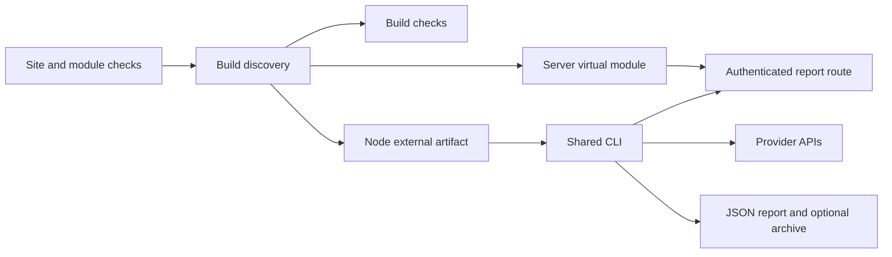

# Nuxt Check-in

[![npm version][npm-version-src]][npm-version-href]
[![npm downloads][npm-downloads-src]][npm-downloads-href]
[![License][license-src]][license-href]
[![Nuxt][nuxt-src]][nuxt-href]

> Run deterministic checks from your Nuxt app and its modules, through a route or a CLI.

## Why Nuxt Check-in?

A site can return 200 on every page while its catalog goes stale or a queue backs up. You find out when a user does.

- 🕳️ **Missing evidence reads as healthy**: A check that never ran or could not read its data leaves no trace in a pass/fail route.
- 🧵 **Scattered probes**: Each site and module writes its own health script, with its own auth and output shape.
- ⏱️ **Silent runners**: A scheduled check-in stops, and the last green report keeps looking current.

Nuxt Check-in finds checks at build time. You run them through a route you own or through its CLI. Every report carries `coverage`, so a missing result never reads as a pass.

## Features

- 🔍 **Build-time discovery**: Files in `server/checks` register from every layer, and a duplicate ID stops the build.
- 📊 **Coverage-aware reports**: A required check that is missing or unavailable marks the report incomplete.
- 🧩 **Module integrations**: D1, Queue Job backlog, and Sentry checks register from module options.
- 🔗 **Shared collection**: Checks that read the same evidence share one load per run.
- 🖥️ **Shared CLI**: External and build checks run with exit codes and optional archives.
- ✅ **Report validation**: `checkReport` catches a stale, mismatched, or incomplete report from an external runner.
- 🧠 **Prompt items**: Site-specific analysis instructions travel in the report for a check-in agent.

## Installation

```bash
npx nuxi@latest module add @harlan-zw/nuxt-checkin
```

> [!TIP]
> Generate an Agent Skill for this package using [skilld](https://github.com/harlan-zw/skilld):
> ```bash
> npx skilld add @harlan-zw/nuxt-checkin
> ```

The command adds the module to your Nuxt config:

```ts
export default defineNuxtConfig({
  modules: ['@harlan-zw/nuxt-checkin'],
})
```

The module scans `server/checks` in the app and every Nuxt layer.
Use `checkin.dirs` to supply explicit paths relative to the app root.
The scan skips tests, declaration files, and files that start with `_`.
Each file must default-export a factory call with a literal `id`.
Duplicate IDs stop the build. Discovery never executes check files.

## Site checks

```ts
// server/checks/catalog.ts
import { defineCheck, fail, pass, warn } from '@harlan-zw/nuxt-checkin/server'
import { readCatalogAge } from '../utils/catalog'

export default defineCheck({
  id: 'catalog.freshness',
  async run({ now, signal }) {
    const hours = await readCatalogAge({ now, signal })
    if (hours >= 24)
      return fail('Catalog is over 24 hours old.', { hours })
    if (hours >= 6)
      return warn('Catalog is over 6 hours old.', { hours })
    return pass({ hours })
  },
})
```

Checks receive `event`, `now`, `signal`, and named `credentials`.
Use `defineCheck<Event>()` when a custom check needs a typed request event.
The runner supplies one observation time to every check.
If several callers need the same decision, keep the domain logic pure.

## Route

```ts
import { runChecks } from '@harlan-zw/nuxt-checkin/server'
import checks from '#checkin/checks'
import { requireAdmin } from '../../utils/auth'

export default defineEventHandler(async (event) => {
  await requireAdmin(event)
  return runChecks(checks, {
    event,
    identity: { site: 'example.com', environment: 'production', deployment: useRuntimeConfig(event).deploymentVersion },
    required: ['catalog.freshness'],
    concurrency: 4,
    timeoutMs: 10_000,
    totalTimeoutMs: 30_000,
  })
})
```

No route is installed automatically. The consuming app owns authentication.
The virtual module uses static imports and remains server-only.
Importing it loads definitions. Only `runChecks` does the reads.
The registry refreshes when watched check files change during development.

## Results

| Result | Meaning |
| --- | --- |
| `pass(evidence)` | The check established its expected condition. |
| `warn(reason, evidence)` | The check met its warning threshold. |
| `fail(reason, evidence)` | The check met its failure threshold. |
| `unavailable(reason)` | The evidence cannot show whether the condition is healthy. |
| `skipped(reason)` | The check decided it does not apply, so it did not run. |

The versioned report contains `identity`, `observedAt`, `severity`, `coverage`, ordered `results`, and `collections`.
Each result includes its ID and duration.
A failure stays visible even when another check has unavailable evidence.
Warn and Fail results can set `coverage: 'incomplete'` when their evidence is partial.
An empty registry has incomplete coverage.
Each `required` ID that is missing gets an unavailable result. Keep this list separate from discovery.
Always read `coverage` before you trust `severity: pass`.

Thrown exceptions become `Unavailable`. Raw exceptions stay out of the returned report.
Use `onError(error, id)` to record them privately. Exceptions in that callback propagate.
Evidence must contain JSON values. The check author must remove secrets from evidence.
The default total deadline is 30 seconds. Expiry stops queued checks and cancels shared collection.
Independent checks have a separate ten-second default deadline.
To cancel a run, pass an AbortSignal. Underlying work stops only if the check honors that signal.
Do not use checks to perform repairs, deploy, send messages, or change Sentry state.

## Existing modules

Each integration registers the same public factory that a site can import.
You register each integration yourself. Installing a module adds no production queries by default.

```ts
export default defineNuxtConfig({
  modules: [
    '@harlan-zw/nuxt-checkin',
    '@harlan-zw/nuxt-cloudflare',
    '@harlan-zw/nuxt-cf-jobs',
    '@harlan-zw/nuxt-sentry',
  ],
  nuxtCloudflare: {
    checks: [{ id: 'd1.read', binding: 'DB' }],
  },
  cfJobs: {
    queues: { indexing: 'INDEXING_QUEUE' },
    checks: [{
      id: 'queue.indexing',
      queue: 'indexing',
      d1Binding: 'DB',
      warnAfterSeconds: 1800,
      failAfterSeconds: 7200,
      staleAfterSeconds: 900,
    }],
  },
  nuxtSentry: {
    dsn: 'https://public@example.com/1',
    project: 'site',
    checks: [{ id: 'sentry.site', org: 'example', project: 'site' }],
  },
})
```

Sentry checks need `id`, `org`, and `project`; optional `credential` defaults to `sentry`.
Supply the read token through `runChecks(checks, { credentials: { sentry: token } })`.
Never put tokens in Nuxt module options. Options enter the generated registry.

The D1 factory proves a read through the request's binding.
The queue factory reuses the Queue Job backpressure SQL and ignores work scheduled for the future.
It collects every queue once per database per run, using the supplied observation clock.
Set `failMinimumReady` when failure requires both age and volume. Reservation rules remain independent.
It expects the module's standard D1 tables. Missing or incompatible tables produce unavailable evidence.
The Sentry factory reads retained unresolved issues through the organization endpoint and follows pagination.
It sets the project slug on the query and, by default, queries from the Unix epoch.
Use `environment` and `region` (`us` or `de`) to scope production collection.
Use `lookbackDays` only when you want a narrower window.
It warns on unresolved issues. It does not infer user impact or investigate stacks.
A default limit of 100 pages and the total deadline bound collection. A truncated collection gives incomplete coverage.
Known issues remain warnings with incomplete coverage when a later page returns an HTTP error.
A transient HTTP error gets at most one retry. The retry honors a Retry-After wait of up to five seconds.
A longer wait returns unavailable evidence. The factory never retries an authorization failure.
Before you retire an existing Sentry routine, confirm live project access and retained-issue coverage.

A site file behaves the same way:

```ts
// server/checks/queue.ts
import { defineQueueCheck } from '@harlan-zw/nuxt-cf-jobs/checks'

export default defineQueueCheck({
  id: 'queue.indexing',
  queue: 'indexing',
  d1Binding: 'DB',
  warnAfterSeconds: 1800,
  failAfterSeconds: 7200,
})
```

Choose module registration or a site file for each ID. Registering both fails the build.

## Module authors

```ts
nuxt.hook('checkin:register', (registry) => {
  registry.add({
    id: 'catalog.freshness',
    handler: resolver.resolve('./checks'),
    options: { warnAfterSeconds: 3600 },
  })
})
```

The handler default-exports a public factory accepting `{ id, ...options }` and returning a Check.
Handlers use absolute paths. Options must be JSON values.
Nuxt Check-in collects contributions after module setup, so module order does not matter.
If Nuxt Check-in is not installed, a contributing module registers nothing.

## Runtime limits

Cloudflare request bindings belong in authenticated route checks.
Where possible, keep GitHub, provider admin, and broad Sentry credentials in an external runner.
External callers import public factories and call `runChecks` directly; they do not need the virtual registry.
The core runtime imports no Nuxt, Node, or provider SDK code.

## Shared collection

Checks receive `collect(resource, key, load)` for collection shared within one run.
The resource is an object identifying the client or database. The key identifies the evidence being collected.
Keys must not include credentials or personal data; they appear in collection metrics.

```ts
const summary = await context.collect(db, 'catalog.summary', async signal => ({
  value: await readCatalogSummary(db, { signal, now: context.now }),
  metrics: { requests: 1 },
}))
```

Repeated calls share the same promise, including failures. Different collections against one resource run sequentially.
Collection receives the run's signal. If one consumer times out, evidence that another consumer needs keeps loading.
The run cancels outstanding collection when it finishes. Underlying operations must support cancellation to stop work.
No collection cache survives between runs. Credentials are copied and frozen for each run.

`collections` reports duration, completion, and available request, rows-read, and byte counts.
A missing measurement means unknown. A completed collection can still produce an unhealthy or unavailable result.
Queue collections include D1 rows-read metadata when the binding returns it.

Direct callers can import `collectQueueEvidence` and `evaluateQueueCheck` from `@harlan-zw/nuxt-cf-jobs/checks`.
Sentry callers can import `collectSentryIssues` from `@harlan-zw/nuxt-sentry/checks`.
Module registration uses the same collectors.

## External report validation

The external runner owns schedules, credentials, storage, and its own list of required IDs.
`checkReport` validates an untrusted report against those expectations. It does not touch the network or storage.

```ts
import { checkReport } from '@harlan-zw/nuxt-checkin/server'

const result = checkReport(await loadLatestReport(), {
  identity: { site: 'example.com', environment: 'production', deployment: expectedDeployment },
  required: ['catalog.freshness', 'queue.indexing'],
  maxAgeMs: 26 * 60 * 60 * 1000,
})
```

These reports are unavailable: missing, stale, wrong identity, unknown schema version, or missing a required result.
The validator recomputes health from individual results. Known failures retain incomplete coverage when other evidence is missing.
An identity is optional for local `runChecks` calls; external validation always requires a matching identity.

Run this validation on its own schedule. It then catches a site check-in that stopped running.
If a new run fails, keep the previous complete report with its original timestamp.
This package does not install a scheduler, persistence service, or public route.

## Shared CLI

The module also scans `checks/external` and `checks/build` in every layer.
Each file exports one check with a literal ID.
Use `execution: 'external'` or `execution: 'build'` for module registrations.
Server registrations keep the default execution context.
Discovered `.ts` and `.mts` build and external checks join Nuxt’s Node type project.
Legacy Nuxt type configuration includes them too. JavaScript files follow the app’s existing type-check policy.
IDs must be unique within each execution context.

```ts
export default defineNuxtConfig({
  modules: ['@harlan-zw/nuxt-checkin'],
  checkin: {
    external: {
      required: ['site.report', 'site.home', 'sentry.site'],
      credentials: { sentry: 'SENTRY_AUTH_TOKEN' },
      timeoutMs: 30_000,
      totalTimeoutMs: 45_000,
      save: {
        dir: '.checkin',
        stateFile: 'state.json',
        timestampKey: 'lastRun',
        baseline: 'daily',
      },
    },
    build: { required: ['content.ready'] },
  },
})
```

```ts
// checks/external/report.ts
import { defineReportCheck } from '@harlan-zw/nuxt-checkin/external'

export default defineReportCheck({
  id: 'site.report',
  url: 'https://example.com/api/internal/checkin',
  site: 'example.com',
  environment: 'production',
  deploymentEnv: 'CHECKIN_DEPLOYMENT',
  tokenEnv: 'CHECKIN_TOKEN',
  required: ['catalog.freshness'],
  maxAgeMs: 300_000,
})
```

The report helper rejects redirects and bounds response bytes.
It reads the validation clock after receiving the response body.
Omit `tokenEnv` for public reports. Use `authHeader` for Cookie or x-api-key authentication.
The expected deployment and required IDs never come from the received report.

Use `defineHttpCheck` for a status and optional text check.
Set `attempts: 2` for one retry. Recovered failures remain in result evidence.
Use `defineExternalCheck` for custom collections.
Its context adds `rootDir`, runtime `env`, `since`, `previous`, and `clock()` to the shared check context.
Use `runCheckCommand` for bounded, cancellable subprocess collections.
Checks must use asynchronous operations and honor `signal`.
Synchronous work can block Node timers.

```sh
pnpm exec nuxt-checkin prepare
pnpm exec nuxt-checkin
pnpm exec nuxt-checkin --save
pnpm exec nuxt-checkin --since 2026-09-15T00:00:00Z
```

`prepare` finds checks. It does not run build checks or need a production build.
It writes `.nuxt/checkin/external.mjs`, a Node artifact containing only external checks and public configuration.
Node checks cannot use Nuxt aliases. Server handlers stay in the server virtual module.
`prepare` records custom build directories for later CLI runs.
To pick an artifact yourself, use `--artifact path`.
Build checks run during `build:before`. Warnings, failures, or incomplete coverage stop the build.

The CLI prints the shared JSON report.
Exit codes are `0` for complete passing coverage, `1` for warnings or failures, and `2` for incomplete coverage.
Archives require `--save`. Files use mode `0600`; new directories use mode `0700`.
Every attempt receives a unique archive file.
The latest policy advances state only after complete passing coverage.
The daily policy preserves the first complete report for each UTC day, including warnings and failures.
Incomplete coverage never advances either baseline. Saving does not change health verdicts or exit codes.
Omit `stateFile` for archives without baseline state.
`DAILY_CHECKIN_DIR` overrides `save.dir` at execution time by default.
The controller supplies this directory outside disposable worktrees.
Set `dirEnv` to use another environment variable.
If the selected variable is empty or unset, the CLI uses `save.dir`.

### Prompt items

A site can add analysis instructions next to its external checks:

```ts
export default defineNuxtConfig({
  checkin: {
    external: {
      required: ['site.activity'],
      prompts: [{
        id: 'feedback',
        prompt: 'Review new user feedback in site.activity. Group problems and suggest one action per problem.',
      }],
    },
  },
})
```

The CLI copies these items into the top-level `prompts` array in its JSON report and archive.
The check-in agent reads them against the collected evidence.
The module never executes prompt text or sends it to a model.
Prompt items cannot change check severity, coverage, or exit codes.
The central daily-checkin Skill owns collection, storage, report writing, and publication rules.
Sites keep their checks, thresholds, credentials, and prompt items in module configuration.

Credentials resolve at execution time. Configuration contains environment names, never credential values.
For file fallback, use `{ env: 'SENTRY_AUTH_TOKEN', files: [{ path: '~/.sentryclirc', section: 'auth', key: 'token' }] }`.
If the environment variable is not set, the CLI reads the files in order.
It ignores a missing file. Other read failures stay visible.


```mermaid
flowchart LR
  definitions[Site and module checks] --> discovery[Build discovery]
  discovery --> build[Build checks]
  discovery --> server[Server virtual module]
  discovery --> external[Node external artifact]
  server --> route[Authenticated report route]
  external --> cli[Shared CLI]
  cli --> route
  cli --> providers[Provider APIs]
  cli --> report[JSON report and optional archive]
```

## Sponsors

<p align="center">
  <a href="https://raw.githubusercontent.com/harlan-zw/static/main/sponsors.svg">
    
  </a>
</p>

## License

Licensed under the [MIT license](https://github.com/harlan-zw/harlan-nuxt/blob/main/packages/nuxt-checkin/LICENSE.md).

<!-- Badges -->
[npm-version-src]: https://img.shields.io/npm/v/%40harlan-zw%2Fnuxt-checkin/latest.svg?style=flat&colorA=18181B&colorB=28CF8D
[npm-version-href]: https://npmjs.com/package/@harlan-zw/nuxt-checkin

[npm-downloads-src]: https://img.shields.io/npm/dm/%40harlan-zw%2Fnuxt-checkin.svg?style=flat&colorA=18181B&colorB=28CF8D
[npm-downloads-href]: https://npmjs.com/package/@harlan-zw/nuxt-checkin

[license-src]: https://img.shields.io/github/license/harlan-zw/harlan-nuxt.svg?style=flat&colorA=18181B&colorB=28CF8D
[license-href]: https://github.com/harlan-zw/harlan-nuxt/blob/main/packages/nuxt-checkin/LICENSE.md

[nuxt-src]: https://img.shields.io/badge/Nuxt-18181B?logo=nuxt
[nuxt-href]: https://nuxt.com
